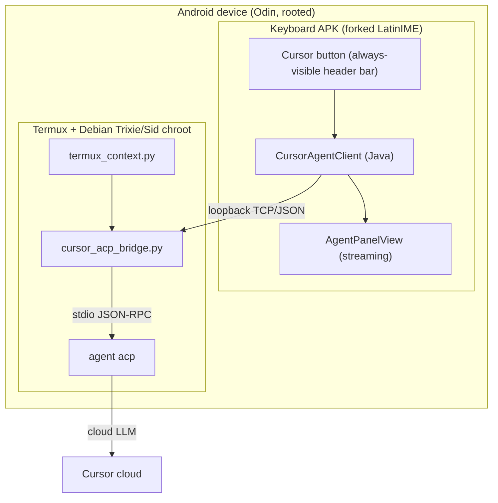

# Cursor Keyboard

A fork of the **AOSP/crDroid LatinIME** keyboard with a native **Cursor agent**
integration: a `Cursor` button on the keyboard starts a Cursor CLI agent that
sees the shell context from the device's terminal and streams suggestions back
into the keyboard, which you can insert into the field.

The agent runs on the device (inside a Debian chroot/Termux) and is reached over
loopback, so it can act on the actual device terminal and files.

## Architecture



## Components

| Component | Path | Notes |
|-----------|------|-------|
| Keyboard (fork) | `build.gradle`, `java/` | AOSP LatinIME + `com.android.inputmethod.latin.cursor.*` |
| Agent client | `java/src/.../cursor/CursorAgentClient.java` | ACP JSON-RPC over a local socket |
| Streaming panel | `.../cursor/AgentPanelView.java` + `res/layout/agent_panel.xml` | Inline reply panel with Insert / Stop / Allow-Deny |
| Controller | `.../cursor/CursorAgentController.java` | Wires client + panel + input connection |
| Settings | `AgentSettingsActivity.java` | Bridge host/port, model, auto-approve, context toggle |
| Bridge daemon | `bridge/cursor_acp_bridge.py` | Spawns `agent acp`, serves `cursor_keyboard/get_context` |
| Termux context | `bridge/termux_context.py` + `termux_context_hook.sh` | Captures `pwd`, history, uname |

## Build

Prereqs: JDK 17+, Android SDK (platform 35, build-tools, NDK 27+) at
`ANDROID_HOME` (set `sdk.dir` in `local.properties` if not using the env var).

```bash
./gradlew assembleDebug
# APK: build/outputs/apk/debug/LatinIME-debug.apk
```

## Install on the device

The stock crDroid ROM already ships a `com.android.inputmethod.latin` system
app. To install this fork over it, disable/remove the stock one first (root):

```bash
adb install -r build/outputs/apk/debug/LatinIME-debug.apk
# or, if the stock app blocks it:
adb shell pm uninstall --user 0 com.android.inputmethod.latin
adb install -r build/outputs/apk/debug/LatinIME-debug.apk
adb shell ime enable com.android.inputmethod.latin/.LatinIME
adb shell ime set com.android.inputmethod.latin/.LatinIME
```

## On-device Cursor agent setup

See [`bridge/README.md`](bridge/README.md) for the full guide. Summary:

1. Install the Cursor CLI in the Debian Trixie/Sid chroot and verify `agent --version`.
2. Authenticate (prefer a **user-scoped** API key).
3. Run the bridge: `python3 cursor_acp_bridge.py --host 127.0.0.1 --port 9043 --workspace ~`.
4. (Optional) source `termux_context_hook.sh` to keep the context fresh.
5. Open the **Cursor Agent Settings** app and set `Bridge host`/`Bridge port` to
   `127.0.0.1` / `9043`.

## Usage

In a terminal field (e.g. Termux), tap the **Cursor** button on the keyboard. The
keyboard reads the surrounding text, requests shell context from the bridge, and
sends it to the agent. The reply streams into the panel; tap **Insert** to commit
it into the field, **Stop** to cancel, and **Allow**/**Deny** to answer tool
permission requests (Auto-approve can be enabled in settings).

## Verify end to end

- `agent --version` runs in the chroot (not a loader error).
- Bridge prints `[bridge] listening on 127.0.0.1:9043`.
- Tap Cursor → panel shows `Connecting...` then `Agent running...` → text streams.
- Tap a proposed command, then **Insert** → it appears in the terminal field.

## Notes / known limitations

- The on-device integration targets arm64; if the bundled Node fails to load,
  install the arm64 runtime libs (see `bridge/README.md`).
- The package name stays `com.android.inputmethod.latin` (v1). A future package
  rename to a unique id avoids the stock-app conflict; the JNI native methods are
  registered by explicit class-name strings, so that rename is a string sweep.
- Tool-call permission flow follows the ACP `session/request_permission` shape;
  exact payload structs may need adjustment against a specific Cursor CLI version.
